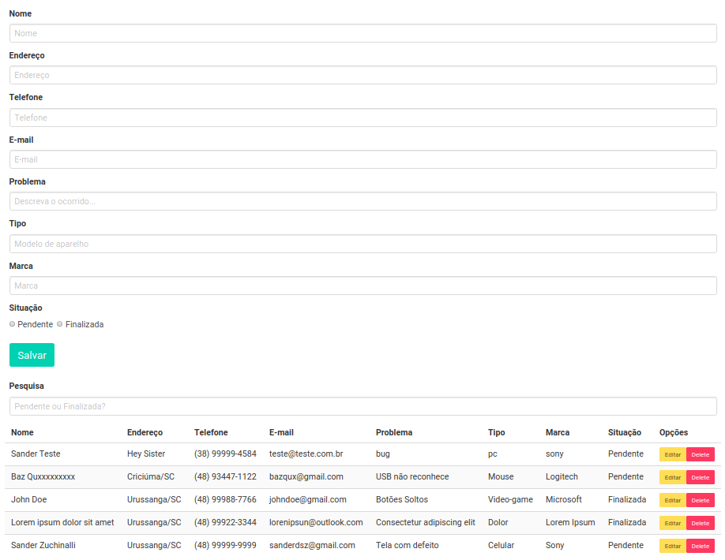
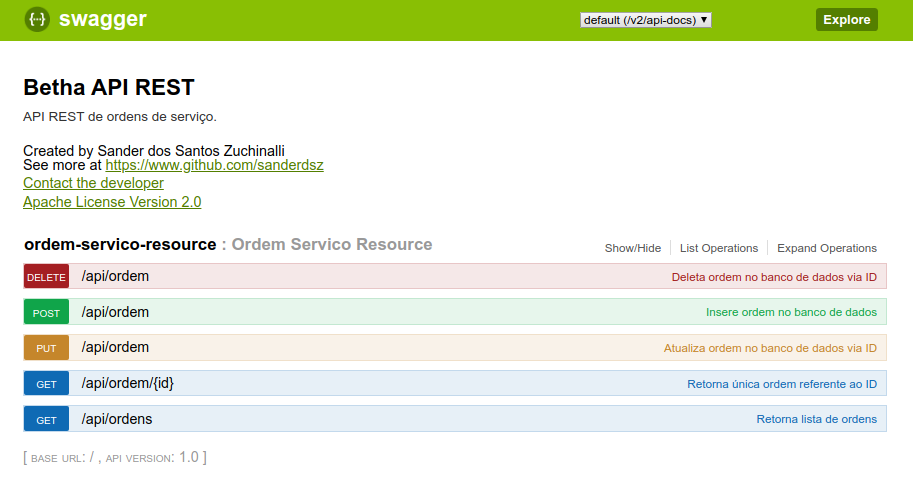

<h3 align="center">
    
    <br><br>
    <b>Recycle and save the environment</b> 
</h3>

<p align="center">
  <a href="https://www.linkedin.com/in/sandersz/">
    
  </a>

  

  

  
</p>

## :computer: Web and Server

<h1 align="center">
    
    
</h1>

## :fire: Live Demo


**[Server](https://betha-api.herokuapp.com/swagger-ui.html)**
##### *Start the server before the web client*

**[Web](http://betha-frontend.herokuapp.com/)**

## :bookmark: About

The <strong>Work-orders</strong> is a web app made to manage to apply CRUD options into a small work orders list.

## :rocket: Tech Used

This project was made with the following technologies:

- [Spring-boot](https://spring.io/)
- [Vue.js](https://vuejs.org/)

## :heavy_check_mark: How to

- ### **Requirements**

  - **necessary** **[Node.js](https://nodejs.org/en/)**
  - **necessary** **[Java 1.8](https://openjdk.java.net/)**
  - **necessary** **[Postgres 11.1+](https://www.postgresql.org/download/)**
  - **necessary** **[Maven 3](https://maven.apache.org/)**
  - You, **need** a package manager like **[NPM](https://www.npmjs.com/)** or **[Yarn](https://yarnpkg.com/)**.

1. Clone the repo :

```sh
  $ git clone https://github.com/sanderdsz/work-orders.git
```

2. Execute the app:

```sh
  # Install all dependencies for the web client
  $ cd client
  $ npm install

  # Start the server API
  $ cd ./sources/server
  $ mvn spring-boot:run
  # You also can run via your IDE into your main class 
  $ com.sander.betha.BethaApplication

  # To use the local server go to the path below and follow the instructions
  $ cd ./sources/client/src/services
  $ vim config.js

  # Start the web application
  $ cd ./sources/client
  $ npm run serve

```

## :memo: License

This project is under MIT license. [LICENSE](LICENSE.md)

## :mailbox_with_mail: Get in touch!

<a href="https://sanderzuchinalli.netlify.app/" target="_blank" >
  
</a>&nbsp;&nbsp;&nbsp;
<a href="https://www.linkedin.com/in/sandersz/" target="_blank" >
  
</a>&nbsp;&nbsp;&nbsp;
<a href="mailto:sanderdsz@gmail.com" target="_blank" >
  
</a> 